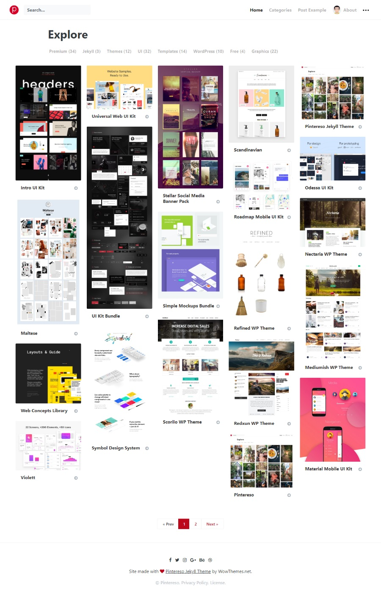

# "Pintereso" - Jekyll Template by WowThemes.net

[Live Demo](https://wowthemesnet.github.io/template-pintereso-bootstrap-jekyll/) &nbsp; | &nbsp; [Download](https://github.com/wowthemesnet/template-pintereso-bootstrap-jekyll/archive/master.zip) &nbsp; | &nbsp; [Buy me a coffee](https://www.wowthemes.net/donate/) &nbsp; | &nbsp; [Documentation](https://bootstrapstarter.com/template-pintereso-bootstrap-jekyll/) &nbsp; | &nbsp; [WordPress version](https://www.wowthemes.net/themes/pinpresso-wordpress/)

### Copyright

Copyright (C) 2018 WowThemes.net.

**Pintereso for Jekyll** is designed by [Sal](https://www.wowthemes.net) and it is licensed MIT. If you want to thank Sal:

-----------------

## Contribute

- Clone the repo.
- Create a branch off of master and give it a meaningful name (e.g. my-new-feature).
- Open a pull request on GitHub and describe the feature or fix. 

Thank you!

[Sal](https://www.wowthemes.net)
